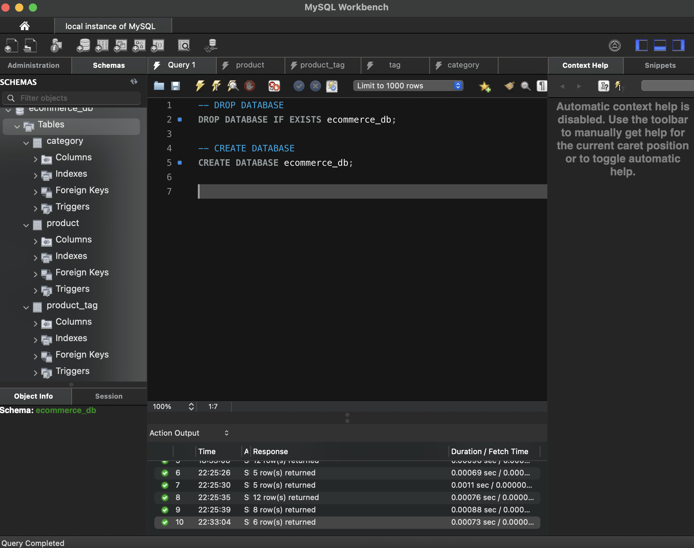

# Ecomerce-Backend
# Description
Ecomerce-BackEnd is an application that allows a client/user to update,view and add information/data to a database. additional applications used were Insomnia and MySQL.  
<a href="https://youtu.be/A_wUsUgEyFA"> Deployed app </a> <----- Click here for video demo
 

 

 

# Installation
<ul>
<li>run "npm i" to install all the needed dependencies.</li>
<li>use schema into MySQL workbench to create database.</li>
<li>rename .env.example file and add your credentials (database name,user name, and password)</li>
<li>open package.json on integrated terminal and "npm run seed" </li>
<li>on integrated terminal run "npm start" to start the application.</li>

 

## Contact information 

for any clarification or questions, contact me! email: dyylancasanova17@gmail.com  
for pull request:
GitHub: Dylan-Casanova